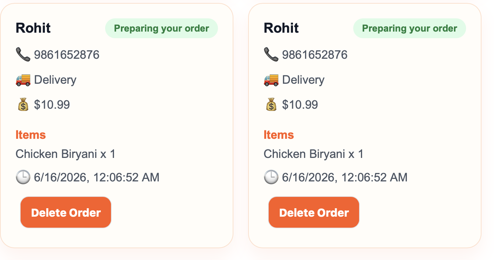
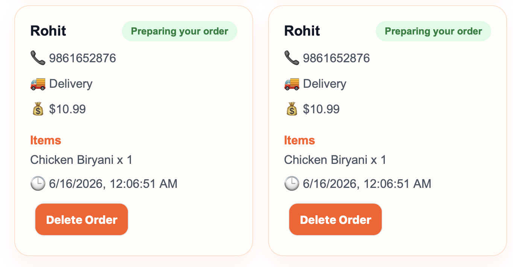

# Foodify

Foodify is a full-stack food ordering web application built with **React, Vite, Node.js, Express, and MongoDB Atlas**.

Users can browse restaurants and food items, add items to cart, place orders, and view admin orders saved permanently in MongoDB.

## Live Demo

- Frontend: https://foodify-beige.vercel.app
- Backend: https://foodify-backend-qkax.onrender.com

## Backend API Links

- Foods API: https://foodify-backend-qkax.onrender.com/api/foods
- Orders API: https://foodify-backend-qkax.onrender.com/api/orders

## Screenshots

### Homepage



### Admin Orders



## Tech Stack

### Frontend
- React
- Vite
- CSS
- Vercel

### Backend
- Node.js
- Express.js
- MongoDB Atlas
- Mongoose
- Render

## Features

- Update order status from Admin Orders
- Status dropdown with Preparing, Out for delivery, and Delivered
- Active menu filter highlighting
- Clear Filters button for search and filters

- Responsive food ordering UI
- Restaurant section
- Menu section
- Add to cart
- Increase/decrease quantity
- Remove from cart
- Coupon support
- Order form
- Order summary
- Order status display
- Admin Orders section
- Orders saved permanently in MongoDB
- Delete order from Admin Orders
- Live frontend connected to live backend

## Project Structure

```txt
foodify/
├── backend/
│   ├── models/
│   │   └── Order.js
│   ├── server.js
│   └── package.json
├── screenshots/
│   ├── homepage.png
│   └── admin-orders.png
├── src/
│   ├── components/
│   │   ├── Navbar.jsx
│   │   ├── Hero.jsx
│   │   ├── RestaurantSection.jsx
│   │   ├── MenuSection.jsx
│   │   ├── Cart.jsx
│   │   ├── OrderForm.jsx
│   │   ├── OrderSummary.jsx
│   │   ├── OrderStatus.jsx
│   │   ├── AdminOrders.jsx
│   │   └── Footer.jsx
│   ├── App.jsx
│   ├── App.css
│   └── main.jsx
├── README.md
└── package.json